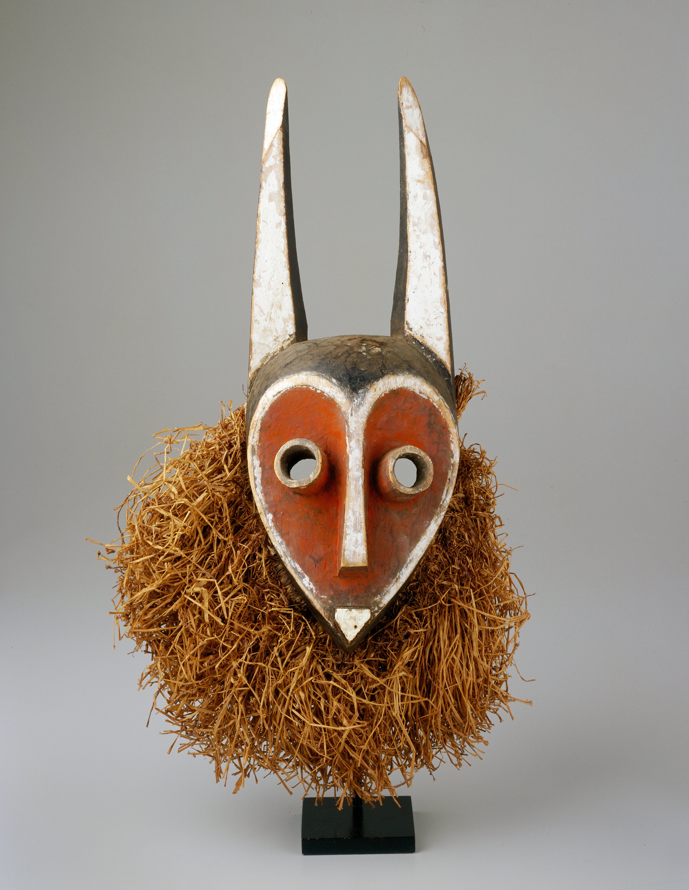

<p align="center">
  
</p>

# Pakati: Regional Control for AI Image Generation

Pakati (meaning "space between" in Shona) is a specialized tool that provides granular control over AI image generation by enabling region-based prompting, editing, and transformation with metacognitive orchestration.

## 🌟 Key Features

- **Regional Prompting**: Apply different prompts to specific regions of the same canvas
- **Persistent Regions**: Save completed regions while modifying others
- **Multi-Model Integration**: Seamlessly switch between different AI models for specialized tasks
- **Deterministic Generation**: Use seeded generation for reproducible results
- **Progressive Refinement**: Build complex images through incremental editing
- **Computational Efficiency**: Only regenerate specified regions, reducing processing time and resources
- **Metacognitive Orchestration**: Guide the generation process with high-level goals while maintaining coherence
- **🆕 Reference-Based Refinement**: Use annotated reference images to guide iterative improvements
- **🆕 Multi-Pass Generation**: Autonomous improvement through multiple generation passes
- **🆕 Delta Analysis**: Intelligent comparison between generated and reference images
- **🆕 Template System**: Save and reuse successful configurations
- **🆕 Reference Understanding Engine**: Revolutionary approach where AI "learns" references by reconstructing them from partial information
- **🆕 Progressive Masking**: Multiple masking strategies to test AI's understanding depth
- **🆕 Understanding Validation**: Quantitative measurement of how well AI understands references
- **🆕 Skill Transfer**: Use understanding pathways from references for better generation

## 🧠 Metacognitive Architecture

Pakati goes beyond simple regional control by implementing a metacognitive orchestration layer that provides:

1. **Context Management**: Maintains persistent state, history, and relationships between elements
2. **Goal-Directed Planning**: Converts high-level intentions into structured, executable plans
3. **Reasoning Engine**: Optimizes parameters and resolves conflicts using a combination of neural and classical approaches
4. **Multi-Model Selection**: Dynamically selects the most appropriate AI model for each task based on capabilities and constraints
5. **Intuitive Checking**: Ensures generated images semantically align with the user's higher-level goals

This orchestration layer enables Pakati to function as a coherent system rather than a collection of disconnected tools, maintaining consistency across multiple edits while pursuing a unified goal.

## 📋 Technical Approach

### Region-Based Diffusion

Pakati uses a modified diffusion process that applies noise selectively to masked regions:

$$\mathbf{x}_t = \sqrt{\alpha_t} \mathbf{x}_0 + \sqrt{1 - \alpha_t} \mathbf{\epsilon}$$

Where:
- $\mathbf{x}_t$ is the noised image at timestep $t$
- $\mathbf{x}_0$ is the original image
- $\alpha_t$ is the noise schedule parameter at timestep $t$
- $\mathbf{\epsilon}$ is the random noise

For regional control, we apply a mask $\mathbf{M}$ to create a combined image:

$$\mathbf{x}_{\text{combined}} = \mathbf{M} \odot \mathbf{x}_{\text{region}} + (1 - \mathbf{M}) \odot \mathbf{x}_{\text{original}}$$

Where $\odot$ represents element-wise multiplication.

### Cross-Attention Control

For text-guided regional generation, we modify the cross-attention mechanisms:

$$\text{Attention}(Q, K, V) = \text{softmax}\left(\frac{QK^T}{\sqrt{d_k}} \cdot \mathbf{M}_{\text{attention}}\right)V$$

Where $\mathbf{M}_{\text{attention}}$ is a spatial attention mask derived from the user-defined region.

### Orchestration and Planning

Pakati's orchestration layer employs a hierarchical planning approach:

1. **Task Decomposition**: Break down high-level goals into regional tasks
2. **Model Selection**: Select optimal models for each task based on capabilities
3. **Parameter Optimization**: Solve for optimal parameters using a hybrid neural/classical approach
4. **Conflict Resolution**: Identify and resolve conflicts between regions using constraint satisfaction techniques

The planner uses a task representation model:

```python
Task(
    id="unique_task_id",
    task_type="generation|inpainting|refinement",
    region=[(x1,y1), (x2,y2), ...],  # Polygon vertices
    prompt="text prompt for this region",
    model_name="model_id",
    parameters={"guidance_scale": 7.5, "steps": 50}
)
```

Tasks are organized into a directed acyclic graph (DAG) based on dependencies, enabling optimal execution ordering with possible parallelization.

### Hybrid Optimization

The solver module employs classical optimization techniques alongside neural models for tasks where deterministic approaches are more efficient:

1. **Linear Programming**: For parameter optimization with linear constraints
2. **Non-Linear Optimization**: For complex parameter spaces with non-linear interactions
3. **Layout Optimization**: For optimal placement of regions
4. **Color Optimization**: For color coherence across regions
5. **Mask Optimization**: For optimal blending between regions

## 🔧 Installation

```bash
# Clone the repository
git clone https://github.com/yourusername/pakati.git
cd pakati

# Create a virtual environment
python -m venv env
source env/bin/activate  # On Windows: env\Scripts\activate

# Install dependencies
pip install -r requirements.txt

# Set up environment variables
cp env.example .env
# Edit .env with your API keys
```

## 💻 Usage

### Basic Usage

```python
from pakati import PakatiCanvas

# Initialize canvas
canvas = PakatiCanvas(width=1024, height=1024)

# Define regions
region1 = canvas.create_region([(100, 100), (300, 100), (300, 300), (100, 300)])
region2 = canvas.create_region([(400, 400), (600, 400), (600, 600), (400, 600)])

# Apply prompts to regions
canvas.apply_to_region(region1, prompt="a majestic lion", model="stable-diffusion-xl")
canvas.apply_to_region(region2, prompt="a serene lake with mountains", model="dalle-3")

# Generate the composite image
result = canvas.generate(seed=42)
result.save("composite_image.png")
```

### 🆕 Reference-Guided Generation

```python
from pakati import EnhancedPakatiCanvas, RefinementStrategy

# Initialize enhanced canvas with goal
canvas = EnhancedPakatiCanvas(width=1024, height=768)
canvas.set_goal("Create a majestic mountain landscape at golden hour")

# Add reference images with annotations
mountain_ref = canvas.add_reference_image(
    "references/mountains.jpg",
    "dramatic mountain peaks with snow caps",
    aspect="composition"
)

sky_ref = canvas.add_reference_image(
    "references/golden_sky.jpg", 
    "warm golden hour lighting",
    aspect="lighting"
)

# Define regions
sky_region = canvas.create_region([(0, 0), (1024, 0), (1024, 300), (0, 300)])
mountain_region = canvas.create_region([(0, 300), (1024, 300), (1024, 768), (0, 768)])

# Apply generation with reference guidance
canvas.apply_to_region_with_references(
    sky_region,
    prompt="dramatic sky at golden hour",
    reference_descriptions=["warm golden hour lighting"]
)

canvas.apply_to_region_with_references(
    mountain_region,
    prompt="majestic mountain peaks",
    reference_descriptions=["dramatic mountain peaks"]
)

# Generate with iterative refinement
final_image = canvas.generate_with_refinement(
    max_passes=5,
    target_quality=0.85,
    strategy=RefinementStrategy.ADAPTIVE,
    seed=42
)

final_image.save("refined_landscape.png")

# Save as template for reuse
canvas.save_template("Mountain Landscape", "templates/mountain_template.json")
```

### Advanced Usage with Orchestration

```python
from pakati import PakatiOrchestrator, Context

# Initialize with a high-level goal
context = Context(primary_goal="Create a futuristic cityscape with flying cars")
orchestrator = PakatiOrchestrator(context)

# Create a plan
plan = orchestrator.create_plan("Generate a cityscape with tall buildings and flying vehicles")

# Execute the plan
result = orchestrator.execute_plan(plan.id)

# Analyze and improve the result
alignment = orchestrator.check_alignment(result.image, "futuristic cityscape")
if alignment.score < 0.8:
    improved_plan = orchestrator.refine_plan(plan.id, alignment.suggestions)
    result = orchestrator.execute_plan(improved_plan.id)

result.save("orchestrated_image.png")
```

### Web Interface

```bash
# Start the web server
python -m pakati.server

# Open browser at http://localhost:8000
```

## 📊 Model Compatibility

| Model | Regional Control | Inpainting | ControlNet Compatible | API Integration |
|-------|------------------|------------|------------------------|-----------------|
| Stable Diffusion XL | ✅ | ✅ | ✅ | Local/API |
| DALL-E 3 | ✅ | ✅ | ❌ | OpenAI API |
| Midjourney | ❌ | ❌ | ❌ | Discord Bot |
| Claude 3 Sonnet | ✅ | ✅ | ❌ | Anthropic API |
| Custom Diffusers | ✅ | ✅ | ✅ | HuggingFace |

## 🏗️ Architecture

Pakati employs a layered modular architecture:

### Core Layers

1. **Canvas Layer**: Handles region definition, masking, and composition
2. **Model Interface**: Provides unified access to various AI models
3. **Processing Pipeline**: Manages the workflow of regional generation
4. **Persistence Layer**: Stores and retrieves project states and history

### Metacognitive Orchestration

5. **Context Management**: Maintains state, history, and relationships across operations
6. **Planner**: Converts high-level goals into concrete, executable task sequences
7. **Reasoning Engine**: Optimizes parameters and resolves conflicts between regions
8. **Solver**: Applies classical optimization techniques for deterministic problems
9. **Intuitive Checker**: Ensures generated images align with the user's high-level goals

### Model Hub

10. **Model Registry**: Manages available AI models and their capabilities
11. **Model Selection**: Dynamically selects the most appropriate model for each task
12. **API Integration**: Provides unified interfaces to diverse model providers

## 🔍 Advanced Features

### 🆕 Reference Understanding Engine (Revolutionary)

The most groundbreaking feature in Pakati is the Reference Understanding Engine - a revolutionary approach that goes beyond traditional reference-based generation. Instead of simply using reference images as targets, this system makes the AI "prove" it understands references by reconstructing them from partial information.

#### The Core Insight

Traditional systems show the AI a reference image and say "make something like this." But how do we know the AI truly understands what "like this" means? Our breakthrough insight: **If an AI can perfectly reconstruct a reference image from partial information, it has truly "seen" and understood that image.**

#### How It Works

1. **Progressive Masking**: The system shows AI increasingly complex partial versions of reference images using multiple masking strategies:
   - Random patches
   - Progressive reveal (start small, expand outward)
   - Center-out masking
   - Edge-in masking
   - Quadrant reveal
   - Frequency band masking (structure vs details)
   - Semantic region masking

2. **Reconstruction Challenges**: For each masking strategy and difficulty level, the AI attempts to reconstruct the complete reference image from the partial information.

3. **Understanding Validation**: The system measures reconstruction quality against the ground truth, calculating understanding scores based on:
   - Pixel-level accuracy
   - Perceptual similarity
   - Structural coherence
   - Feature preservation
   - Context understanding

4. **Knowledge Extraction**: Once the AI successfully reconstructs a reference (achieving "mastery"), the system extracts:
   - Visual features the AI learned
   - Composition patterns it discovered
   - Style characteristics it understood
   - The generation pathway it developed

5. **Skill Transfer**: This understanding pathway can then be applied to generate new images, using the AI's proven comprehension rather than surface-level mimicry.

#### Technical Implementation

```python
from pakati import ReferenceUnderstandingEngine, ReferenceImage

# Initialize the understanding engine
engine = ReferenceUnderstandingEngine(canvas_interface=canvas)

# Load a reference image
reference = ReferenceImage("masterpiece.jpg", metadata={
    "style": "impressionist",
    "complexity": "high",
    "focus": "color_harmony"
})

# Make AI learn to understand this reference
understanding = engine.learn_reference(
    reference,
    masking_strategies=[
        'random_patches', 
        'center_out', 
        'progressive_reveal',
        'frequency_bands'
    ],
    max_attempts=15
)

print(f"Understanding Level: {understanding.understanding_level:.2f}")
print(f"Mastery Achieved: {understanding.mastery_achieved}")

# Once understood, use it for generation
generation_guidance = engine.use_understood_reference(
    understanding.reference_id,
    target_prompt="a serene lake at sunset",
    transfer_aspects=["color_harmony", "lighting", "composition"]
)

# Apply the understanding to actual generation
result = canvas.generate_with_understanding(generation_guidance)
```

#### Masking Strategies Explained

Each masking strategy tests different aspects of understanding:

- **Random Patches**: Tests robustness and ability to infer from scattered information
- **Progressive Reveal**: Tests systematic understanding building from core to details
- **Center-Out**: Tests ability to understand composition from focal points
- **Edge-In**: Tests contextual understanding and boundary relationships
- **Frequency Bands**: Tests separation of structure vs texture understanding
- **Semantic Regions**: Tests object-level and semantic comprehension

#### Understanding Metrics

The system calculates multiple understanding scores:

- **Reconstruction Score** (0-1): How accurately the AI reconstructed the missing parts
- **Understanding Score** (0-1): How well the AI grasped the underlying patterns
- **Skill Extraction Score** (0-1): How useful this understanding is for transfer
- **Mastery Threshold**: 0.85+ indicates true understanding has been achieved

#### Scientific Rigor

This approach addresses fundamental limitations in current AI image generation:

1. **Verification Problem**: How do we know if AI understood the reference?
2. **Surface vs Deep Learning**: Traditional methods may only capture superficial similarities
3. **Transfer Quality**: Understanding pathways enable higher-quality skill transfer
4. **Measurable Understanding**: Quantitative metrics for AI comprehension

#### Integration with Existing Systems

The Reference Understanding Engine seamlessly integrates with other Pakati features:

```python
# Use understood references in iterative refinement
refinement = IterativeRefinementEngine(
    canvas_interface=canvas,
    reference_understanding_engine=engine
)

# References with proven understanding get higher priority
result = refinement.refine_with_understanding(
    target_prompt="mountain landscape",
    understood_references=["mountain_photo_1", "lighting_study_2"],
    max_iterations=8
)
```

### 🆕 Reference-Based Iterative Refinement

The breakthrough feature of Pakati is its ability to use annotated reference images to autonomously improve generated content through multiple passes. This addresses the fundamental challenge that describing visual concepts is difficult and AI rarely gets it right on the first try.

#### How It Works

1. **Reference Collection**: Add reference images with specific annotations describing what aspects to use (color, texture, composition, lighting, style)

2. **Delta Analysis**: The system compares generated regions against references, identifying specific differences in color, texture, lighting, etc.

3. **Autonomous Refinement**: Based on detected deltas, the system automatically adjusts prompts and parameters, then regenerates regions

4. **Multi-Pass Learning**: Each pass builds on the previous one, with the system becoming "smarter" as it learns what works

5. **Template Reuse**: Save successful configurations as templates for future use

#### Reference Aspects

- **Color**: Match color palettes and distributions
- **Texture**: Replicate surface textures and details  
- **Composition**: Follow layout and element placement
- **Lighting**: Match lighting conditions and mood
- **Style**: Transfer artistic or photographic styles
- **General**: Overall visual similarity

#### Example Workflow

```python
# Add references for different aspects
canvas.add_reference_image("mountain_photo.jpg", "rocky mountain texture", aspect="texture")
canvas.add_reference_image("sunset_sky.jpg", "warm golden lighting", aspect="lighting") 
canvas.add_reference_image("painting.jpg", "impressionist style", aspect="style")

# The system will iteratively improve the generation to match these references
final_image = canvas.generate_with_refinement(max_passes=8, target_quality=0.9)
```

#### Delta Types Detected

- Color mismatches and palette differences
- Texture variations and detail levels
- Composition and layout issues
- Lighting and mood discrepancies
- Style transfer requirements
- Missing or incorrect details

### Seed Management

Control randomness with deterministic seeding:

```python
# Same region, same prompt, different seeds
result1 = canvas.apply_to_region(region1, prompt="a red apple", seed=42)
result2 = canvas.apply_to_region(region1, prompt="a red apple", seed=123)

# Same output for the same seed
result3 = canvas.apply_to_region(region1, prompt="a red apple", seed=42)  # Will match result1
```

### ControlNet Integration

Apply structural guidance to regions:

```python
# Apply pose control to a specific region
canvas.apply_to_region(
    region1,
    prompt="a person dancing",
    controlnet="openpose",
    controlnet_input=pose_image
)
```

### Parameter Optimization

Automatically optimize parameters for specific regions:

```python
# Let the solver find optimal parameters for this region
solution = orchestrator.solver.solve(
    problem_type="nonlinear",
    objective_function=quality_score,
    initial_guess=[7.5, 50],  # guidance_scale, steps
    bounds=[(5.0, 15.0), (20, 100)]
)

# Apply the optimized parameters
canvas.apply_to_region(
    region1, 
    prompt="complex detailed texture",
    parameters={"guidance_scale": solution["solution"][0], "steps": solution["solution"][1]}
)
```

## 📚 References

1. Rombach, R., Blattmann, A., Lorenz, D., Esser, P., & Ommer, B. (2022). High-Resolution Image Synthesis with Latent Diffusion Models. *CVPR 2022*.
2. Nichol, A., et al. (2021). GLIDE: Towards Photorealistic Image Generation and Editing with Text-Guided Diffusion Models. *arXiv preprint arXiv:2112.10741*.
3. Zhang, L., et al. (2023). Adding Conditional Control to Text-to-Image Diffusion Models. *ICCV 2023*.
4. Meng, C., et al. (2021). SDEdit: Guided Image Synthesis and Editing with Stochastic Differential Equations. *arXiv preprint arXiv:2108.01073*.
5. Dang, H., et al. (2023). Attend-and-Excite: Attention-Based Semantic Guidance for Text-to-Image Diffusion Models. *ACM Transactions on Graphics*.
6. Hertz, A., et al. (2022). Prompt-to-Prompt Image Editing with Cross Attention Control. *arXiv preprint arXiv:2208.01626*.

## 📄 License

This project is licensed under the MIT License - see the LICENSE file for details.

## 🤝 Contributing

Contributions are welcome! Please feel free to submit a Pull Request.

## 🙏 Acknowledgments

- The diffusion model research community
- HuggingFace for their diffusers library
- OpenAI and Anthropic for their image generation APIs

## API Keys

Pakati integrates with multiple model providers to offer flexible image generation capabilities. To use these providers, you need to configure API keys.

Copy the `env.example` file to `.env` in the root of your project and add your API keys:

```
# Copy env.example to .env and fill in your API keys
cp env.example .env
```

The following API keys are supported:

- `PAKATI_API_KEY_OPENAI`: For OpenAI models (DALL-E, GPT-4 Vision)
- `PAKATI_API_KEY_ANTHROPIC`: For Anthropic models (Claude)
- `PAKATI_API_KEY_HUGGINGFACE`: For Hugging Face models (Stable Diffusion)
- `PAKATI_API_KEY_MIDJOURNEY`: For Midjourney
- `PAKATI_API_KEY_REPLICATE`: For Replicate-hosted models

You only need to provide API keys for the models you intend to use. If a key is not provided, Pakati will fall back to locally available models when possible.
