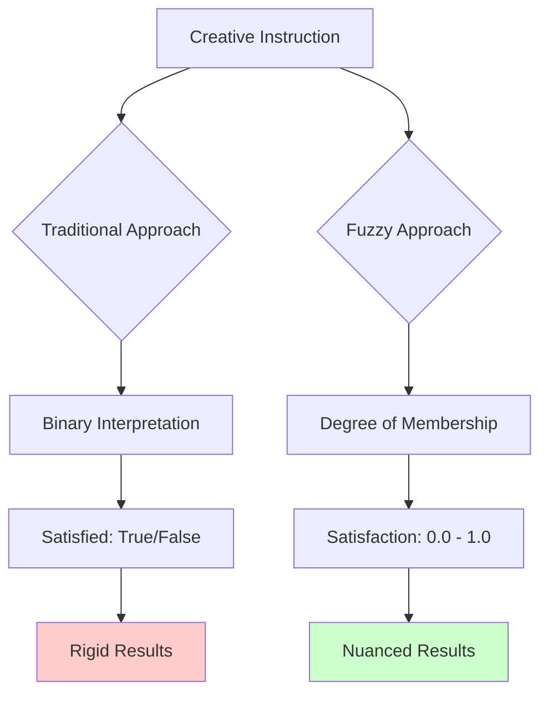

# Fuzzy Logic Integration
{: .fs-9 }

Handle subjective creative instructions using fuzzy sets, linguistic modifiers, and continuous satisfaction metrics.
{: .fs-6 .fw-300 }

---

## Table of Contents
{: .no_toc .text-delta }

1. TOC
{:toc}

---

## The Subjectivity Problem

Traditional AI systems struggle with subjective creative concepts because they treat everything as binary: either a goal is satisfied or it isn't. But creative concepts exist on spectrums:

- "Make it darker" - How much darker? What constitutes "dark enough"?
- "More detailed" - What level of detail is sufficient?
- "Warmer colors" - How warm? Which specific hues?
- "Slightly more abstract" - How do you quantify "slightly"?

**The fundamental issue**: Creative instructions are inherently **fuzzy** - they have degrees of satisfaction rather than binary states.

---

## Fuzzy Logic Foundation

### Traditional vs Fuzzy Approach



### Fuzzy Set Theory

A **fuzzy set** allows partial membership. Instead of asking "Is this image dark?", we ask "To what degree is this image dark?"

$$\mu_{\text{dark}}(x) = \text{membership degree of } x \text{ in the 'dark' set}$$

Where $\mu_{\text{dark}}(x) \in [0, 1]$

- $\mu_{\text{dark}}(x) = 0.0$ → Not dark at all
- $\mu_{\text{dark}}(x) = 0.5$ → Moderately dark  
- $\mu_{\text{dark}}(x) = 1.0$ → Completely dark

---

## Pakati's Fuzzy Logic Engine

### Core Architecture

```python
class FuzzyLogicEngine:
    """Complete fuzzy logic system for creative concepts."""
    
    def __init__(self):
        # Core fuzzy sets for creative concepts
        self.creative_fuzzy_sets = {
            'brightness': self._create_brightness_sets(),
            'color_warmth': self._create_warmth_sets(),
            'detail_level': self._create_detail_sets(),
            'saturation': self._create_saturation_sets(),
            'contrast': self._create_contrast_sets(),
            'satisfaction': self._create_satisfaction_sets()
        }
        
        # Linguistic modifiers
        self.modifiers = {
            'very': lambda x: x ** 2,
            'extremely': lambda x: x ** 3,
            'somewhat': lambda x: x ** 0.5,
            'slightly': lambda x: x ** 0.25,
            'moderately': lambda x: x ** 0.75,
            'quite': lambda x: x ** 1.25,
            'rather': lambda x: x ** 1.5
        }
        
        # Fuzzy rules
        self.rules = []
        self._initialize_creative_rules()
```

### Fuzzy Sets for Creative Concepts

#### Brightness Fuzzy Sets

```python
def _create_brightness_sets(self) -> Dict[str, FuzzySet]:
    """Create fuzzy sets for brightness concepts."""
    
    return {
        'very_dark': FuzzySet('very_dark', 
            membership_func=trapezoid_membership,
            params=[0.0, 0.0, 0.1, 0.25]  # [a, b, c, d] for trapezoid
        ),
        
        'dark': FuzzySet('dark',
            membership_func=trapezoid_membership,
            params=[0.1, 0.25, 0.35, 0.45]
        ),
        
        'medium': FuzzySet('medium',
            membership_func=trapezoid_membership,
            params=[0.35, 0.45, 0.55, 0.65]
        ),
        
        'bright': FuzzySet('bright',
            membership_func=trapezoid_membership,  
            params=[0.55, 0.65, 0.75, 0.85]
        ),
        
        'very_bright': FuzzySet('very_bright',
            membership_func=trapezoid_membership,
            params=[0.75, 0.85, 1.0, 1.0]
        )
    }
```

#### Color Warmth Fuzzy Sets

```python
def _create_warmth_sets(self) -> Dict[str, FuzzySet]:
    """Create fuzzy sets for color warmth concepts."""
    
    return {
        'very_cool': FuzzySet('very_cool',
            membership_func=gaussian_membership,
            params={'center': 0.15, 'width': 0.1}  # Cool blues/cyans
        ),
        
        'cool': FuzzySet('cool',
            membership_func=gaussian_membership,
            params={'center': 0.3, 'width': 0.15}  # Blues/greens
        ),
        
        'neutral': FuzzySet('neutral',
            membership_func=gaussian_membership,
            params={'center': 0.5, 'width': 0.2}   # Balanced colors
        ),
        
        'warm': FuzzySet('warm',
            membership_func=gaussian_membership,
            params={'center': 0.7, 'width': 0.15}  # Oranges/yellows
        ),
        
        'very_warm': FuzzySet('very_warm',
            membership_func=gaussian_membership,
            params={'center': 0.85, 'width': 0.1}  # Deep reds/oranges
        )
    }
```

### Membership Functions

#### Trapezoidal Membership

```python
def trapezoid_membership(x: float, params: List[float]) -> float:
    """Trapezoidal membership function."""
    a, b, c, d = params
    
    if x <= a or x >= d:
        return 0.0
    elif a < x <= b:
        return (x - a) / (b - a)
    elif b < x <= c:
        return 1.0
    elif c < x < d:
        return (d - x) / (d - c)
    
    return 0.0
```

#### Gaussian Membership

```python
def gaussian_membership(x: float, params: Dict[str, float]) -> float:
    """Gaussian membership function."""
    center = params['center']
    width = params['width']
    
    return math.exp(-0.5 * ((x - center) / width) ** 2)
```

#### Triangular Membership

```python
def triangular_membership(x: float, params: List[float]) -> float:
    """Triangular membership function."""
    a, b, c = params
    
    if x <= a or x >= c:
        return 0.0
    elif a < x <= b:
        return (x - a) / (b - a)
    elif b < x < c:
        return (c - x) / (c - b)
    
    return 0.0
```

---

## Linguistic Modifiers

Linguistic modifiers handle words like "very", "slightly", "extremely":

### Modifier Implementation

```python
class LinguisticModifier:
    """Applies linguistic modifiers to fuzzy sets."""
    
    @staticmethod
    def apply_modifier(modifier: str, membership_value: float) -> float:
        """Apply linguistic modifier to membership value."""
        
        modifiers = {
            # Intensifiers
            'very': lambda x: x ** 2,           # Concentrate
            'extremely': lambda x: x ** 3,      # Strong concentration
            'quite': lambda x: x ** 1.25,       # Mild concentration
            'rather': lambda x: x ** 1.5,       # Moderate concentration
            
            # Hedges (reduce intensity)
            'somewhat': lambda x: x ** 0.5,     # Dilate
            'slightly': lambda x: x ** 0.25,    # Strong dilation
            'moderately': lambda x: x ** 0.75,  # Mild dilation
            'kind_of': lambda x: x ** 0.6,      # Casual dilation
            
            # Approximation
            'about': lambda x: x * 0.9 + 0.05,  # Soften boundaries
            'around': lambda x: x * 0.85 + 0.1, # More softening
            
            # Negation
            'not': lambda x: 1.0 - x,           # Complement
            'not_very': lambda x: 1.0 - (x ** 2)  # Not + intensifier
        }
        
        if modifier in modifiers:
            return max(0.0, min(1.0, modifiers[modifier](membership_value)))
        
        return membership_value
```

### Parsing Instructions with Modifiers

```python
def parse_fuzzy_instruction(instruction: str) -> FuzzyInstruction:
    """Parse natural language instruction into fuzzy components."""
    
    # Example: "make it very slightly warmer and more detailed"
    parsed = FuzzyInstruction()
    
    # Tokenize and analyze
    tokens = instruction.lower().split()
    
    current_modifiers = []
    current_concept = None
    
    for i, token in enumerate(tokens):
        if token in ['very', 'extremely', 'somewhat', 'slightly', 'quite', 'rather', 'moderately']:
            current_modifiers.append(token)
            
        elif token in ['darker', 'brighter', 'warmer', 'cooler', 'detailed', 'saturated']:
            concept_map = {
                'darker': ('brightness', 'decrease'),
                'brighter': ('brightness', 'increase'),
                'warmer': ('color_warmth', 'increase'),
                'cooler': ('color_warmth', 'decrease'),
                'detailed': ('detail_level', 'increase'),
                'saturated': ('saturation', 'increase')
            }
            
            if token in concept_map:
                concept, direction = concept_map[token]
                
                fuzzy_component = FuzzyComponent(
                    concept=concept,
                    direction=direction,
                    modifiers=current_modifiers.copy(),
                    strength=calculate_modifier_strength(current_modifiers)
                )
                
                parsed.components.append(fuzzy_component)
                current_modifiers = []
    
    return parsed

# Example result:
# "make it very slightly warmer" ->
# FuzzyComponent(concept='color_warmth', direction='increase', 
#                modifiers=['very', 'slightly'], strength=0.35)
```

---

## Fuzzy Rules System

### Rule Structure

```python
@dataclass
class FuzzyRule:
    """IF-THEN fuzzy rule for creative decisions."""
    
    id: str
    antecedent: FuzzyCondition      # IF part
    consequent: FuzzyAction         # THEN part
    weight: float = 1.0             # Rule importance
    confidence: float = 1.0         # Rule certainty

class FuzzyCondition:
    """Represents the IF part of a fuzzy rule."""
    
    def __init__(self, conditions: List[Tuple[str, str, float]]):
        # Each condition: (concept, fuzzy_set, membership_threshold)
        # Example: [('brightness', 'dark', 0.7), ('saturation', 'low', 0.5)]
        self.conditions = conditions
    
    def evaluate(self, current_state: Dict[str, float]) -> float:
        """Evaluate condition against current state."""
        
        membership_values = []
        
        for concept, fuzzy_set_name, threshold in self.conditions:
            if concept in current_state:
                current_value = current_state[concept]
                fuzzy_set = self.get_fuzzy_set(concept, fuzzy_set_name)
                membership = fuzzy_set.membership(current_value)
                
                # Check if membership meets threshold
                if membership >= threshold:
                    membership_values.append(membership)
                else:
                    membership_values.append(0.0)
            else:
                membership_values.append(0.0)
        
        # Use minimum (AND operation) for multiple conditions
        return min(membership_values) if membership_values else 0.0
```

### Creative Rules

```python
def _initialize_creative_rules(self):
    """Initialize fuzzy rules for creative concepts."""
    
    # Rule 1: If image is very dark, increase brightness significantly
    self.rules.append(FuzzyRule(
        id="dark_brightness_boost",
        antecedent=FuzzyCondition([
            ('brightness', 'very_dark', 0.7)
        ]),
        consequent=FuzzyAction(
            adjustments=[('brightness', 'increase', 0.8)]
        ),
        weight=0.9,
        confidence=0.95
    ))
    
    # Rule 2: If image lacks detail and user wants more detail, enhance details
    self.rules.append(FuzzyRule(
        id="detail_enhancement",
        antecedent=FuzzyCondition([
            ('detail_level', 'low', 0.6),
            ('user_satisfaction', 'low', 0.5)
        ]),
        consequent=FuzzyAction(
            adjustments=[
                ('detail_level', 'increase', 0.7),
                ('sharpness', 'increase', 0.5)
            ]
        ),
        weight=0.8,
        confidence=0.85
    ))
    
    # Rule 3: If colors are too cool and user wants warmth, warm them up
    self.rules.append(FuzzyRule(
        id="warmth_adjustment",
        antecedent=FuzzyCondition([
            ('color_warmth', 'cool', 0.7),
            ('user_intent', 'warmer', 0.6)
        ]),
        consequent=FuzzyAction(
            adjustments=[
                ('color_warmth', 'increase', 0.6),
                ('red_saturation', 'increase', 0.4),
                ('yellow_saturation', 'increase', 0.3)
            ]
        ),
        weight=0.85,
        confidence=0.9
    ))
```

---

## Mamdani Inference Method

Pakati uses the complete Mamdani fuzzy inference process:

### 1. Fuzzification

Convert crisp input values to fuzzy membership degrees:

```python
def fuzzify(self, input_values: Dict[str, float]) -> Dict[str, Dict[str, float]]:
    """Convert crisp inputs to fuzzy membership degrees."""
    
    fuzzified = {}
    
    for concept, value in input_values.items():
        if concept in self.creative_fuzzy_sets:
            fuzzified[concept] = {}
            
            # Calculate membership in each fuzzy set
            for set_name, fuzzy_set in self.creative_fuzzy_sets[concept].items():
                membership = fuzzy_set.membership(value)
                fuzzified[concept][set_name] = membership
    
    return fuzzified

# Example:
# Input: {'brightness': 0.3, 'color_warmth': 0.7}
# Output: {
#     'brightness': {'very_dark': 0.2, 'dark': 0.8, 'medium': 0.1, ...},
#     'color_warmth': {'cool': 0.1, 'neutral': 0.3, 'warm': 0.9, ...}
# }
```

### 2. Rule Evaluation

Evaluate each rule against fuzzified inputs:

```python
def evaluate_rules(self, fuzzified_inputs: Dict[str, Dict[str, float]]) -> List[RuleActivation]:
    """Evaluate all rules and return activations."""
    
    activations = []
    
    for rule in self.rules:
        # Calculate rule activation strength
        activation_strength = rule.antecedent.evaluate(fuzzified_inputs)
        
        if activation_strength > 0:
            activations.append(RuleActivation(
                rule=rule,
                strength=activation_strength * rule.weight * rule.confidence
            ))
    
    return activations
```

### 3. Output Aggregation

Combine outputs from all activated rules:

```python
def aggregate_outputs(self, rule_activations: List[RuleActivation]) -> Dict[str, float]:
    """Aggregate rule outputs using maximum aggregation."""
    
    aggregated = defaultdict(float)
    
    for activation in rule_activations:
        for adjustment in activation.rule.consequent.adjustments:
            concept, direction, strength = adjustment
            
            # Apply activation strength to adjustment
            adjusted_strength = strength * activation.strength
            
            # Maximum aggregation (take the strongest activation)
            key = f"{concept}_{direction}"
            aggregated[key] = max(aggregated[key], adjusted_strength)
    
    return dict(aggregated)
```

### 4. Defuzzification

Convert fuzzy outputs back to crisp values:

```python
def defuzzify(self, aggregated_outputs: Dict[str, float], method: str = 'centroid') -> Dict[str, float]:
    """Convert fuzzy outputs to crisp adjustment values."""
    
    crisp_outputs = {}
    
    for output_key, strength in aggregated_outputs.items():
        if method == 'centroid':
            crisp_value = self._centroid_defuzzification(output_key, strength)
        elif method == 'maximum':
            crisp_value = self._maximum_defuzzification(output_key, strength)
        elif method == 'mean_of_maximum':
            crisp_value = self._mean_of_maximum_defuzzification(output_key, strength)
        else:
            crisp_value = strength  # Simple passthrough
        
        crisp_outputs[output_key] = crisp_value
    
    return crisp_outputs

def _centroid_defuzzification(self, output_key: str, strength: float) -> float:
    """Centroid defuzzification method."""
    
    # Create output membership function based on strength
    x_values = np.linspace(0, 1, 100)
    y_values = np.minimum(strength, self._get_output_membership(output_key, x_values))
    
    # Calculate centroid
    if np.sum(y_values) > 0:
        centroid = np.sum(x_values * y_values) / np.sum(y_values)
        return centroid
    else:
        return 0.5  # Default middle value
```

---

## Integration with Evidence Graph

### Fuzzy Satisfaction Degrees

Instead of binary satisfied/not satisfied, objectives use fuzzy satisfaction:

```python
class Objective:
    """Enhanced objective with fuzzy satisfaction."""
    
    def evaluate_fuzzy_satisfaction(
        self, 
        current_image: Image.Image, 
        fuzzy_engine: FuzzyLogicEngine
    ) -> float:
        """Calculate fuzzy satisfaction degree (0-1)."""
        
        # Extract current image features
        current_features = self._extract_features(current_image)
        
        # Compare with target using fuzzy logic
        satisfaction_components = []
        
        for aspect, target_value in self.target_features.items():
            current_value = current_features.get(aspect, 0.5)
            
            # Calculate fuzzy satisfaction for this aspect
            if aspect in fuzzy_engine.creative_fuzzy_sets:
                # Find best matching fuzzy set
                best_match_satisfaction = 0.0
                
                for set_name, fuzzy_set in fuzzy_engine.creative_fuzzy_sets[aspect].items():
                    target_membership = fuzzy_set.membership(target_value)
                    current_membership = fuzzy_set.membership(current_value)
                    
                    # Satisfaction is how close current is to target
                    satisfaction = 1.0 - abs(target_membership - current_membership)
                    best_match_satisfaction = max(best_match_satisfaction, satisfaction)
                
                satisfaction_components.append(best_match_satisfaction)
        
        # Aggregate using weighted average
        if satisfaction_components:
            return sum(satisfaction_components) / len(satisfaction_components)
        else:
            return 0.5  # Neutral satisfaction
```

### Fuzzy Evidence Collection

```python
def collect_fuzzy_evidence(self, current_image: Image.Image) -> Dict[str, Any]:
    """Collect evidence with fuzzy confidence weighting."""
    
    evidence = {}
    
    for objective in self.objectives:
        # Get fuzzy satisfaction
        satisfaction = objective.evaluate_fuzzy_satisfaction(current_image, self.fuzzy_engine)
        
        # Weight evidence by confidence
        confidence = self._calculate_confidence(objective, current_image)
        weighted_satisfaction = satisfaction * confidence
        
        evidence[objective.id] = {
            'satisfaction': satisfaction,
            'confidence': confidence,
            'weighted_satisfaction': weighted_satisfaction,
            'is_fuzzy': True
        }
    
    return evidence
```

---

## Practical Applications

### Example: "Make it Slightly Warmer"

```python
def process_warmth_instruction():
    """Example of processing 'make it slightly warmer'."""
    
    # 1. Parse instruction
    instruction = "make it slightly warmer"
    parsed = parse_fuzzy_instruction(instruction)
    # Result: FuzzyComponent(concept='color_warmth', direction='increase', 
    #                        modifiers=['slightly'], strength=0.25)
    
    # 2. Analyze current image
    current_features = image_analyzer.extract_features(current_image)
    current_warmth = current_features['color_warmth']  # e.g., 0.4
    
    # 3. Fuzzify current state
    fuzzified = fuzzy_engine.fuzzify({'color_warmth': current_warmth})
    # Result: {'color_warmth': {'cool': 0.8, 'neutral': 0.3, 'warm': 0.1}}
    
    # 4. Apply fuzzy rules
    rule_activations = fuzzy_engine.evaluate_rules(fuzzified)
    
    # 5. Generate adjustment
    adjustments = fuzzy_engine.aggregate_outputs(rule_activations)
    crisp_adjustments = fuzzy_engine.defuzzify(adjustments)
    
    # 6. Apply "slightly" modifier
    final_adjustment = apply_modifier('slightly', crisp_adjustments['color_warmth_increase'])
    # Result: 0.15 (instead of 0.6 for full warmth increase)
    
    # 7. Generate new image with subtle warmth increase
    new_target_warmth = min(1.0, current_warmth + final_adjustment)
    enhanced_prompt = enhance_prompt_for_warmth(original_prompt, new_target_warmth)
    
    return generate_image(enhanced_prompt)
```

### Example: "More Detailed but Not Too Sharp"

```python
def process_complex_instruction():
    """Handle complex instruction with multiple fuzzy concepts."""
    
    instruction = "more detailed but not too sharp"
    
    # Parse into components
    components = [
        FuzzyComponent(concept='detail_level', direction='increase', strength=0.7),
        FuzzyComponent(concept='sharpness', direction='decrease', modifiers=['not_too'], strength=0.3)
    ]
    
    # Process each component
    adjustments = {}
    
    for component in components:
        current_value = current_features[component.concept]
        
        # Calculate fuzzy adjustment
        if component.direction == 'increase':
            target_membership = min(1.0, current_value + component.strength)
        else:
            target_membership = max(0.0, current_value - component.strength)
        
        adjustments[component.concept] = target_membership
    
    # Balance conflicting requirements
    # Detail increase: 0.7, Sharpness constraint: -0.3
    # Result: Increase detail moderately while slightly reducing sharpness
    
    return generate_balanced_adjustment(adjustments)
```

---

## Performance Optimizations

### Fuzzy Set Caching

```python
class FuzzySetCache:
    """Cache membership function evaluations for performance."""
    
    def __init__(self, cache_size: int = 10000):
        self.cache = LRUCache(maxsize=cache_size)
    
    def get_membership(self, fuzzy_set_id: str, value: float) -> float:
        """Get membership with caching."""
        
        cache_key = f"{fuzzy_set_id}:{value:.4f}"
        
        if cache_key in self.cache:
            return self.cache[cache_key]
        
        # Calculate membership
        fuzzy_set = self.get_fuzzy_set(fuzzy_set_id)
        membership = fuzzy_set.membership(value)
        
        # Cache result
        self.cache[cache_key] = membership
        
        return membership
```

### Parallel Rule Evaluation

```python
def evaluate_rules_parallel(self, fuzzified_inputs: Dict[str, Dict[str, float]]) -> List[RuleActivation]:
    """Evaluate rules in parallel for performance."""
    
    from concurrent.futures import ThreadPoolExecutor
    
    def evaluate_single_rule(rule):
        activation_strength = rule.antecedent.evaluate(fuzzified_inputs)
        if activation_strength > 0:
            return RuleActivation(rule=rule, strength=activation_strength)
        return None
    
    with ThreadPoolExecutor(max_workers=4) as executor:
        future_to_rule = {executor.submit(evaluate_single_rule, rule): rule for rule in self.rules}
        
        activations = []
        for future in future_to_rule:
            result = future.result()
            if result is not None:
                activations.append(result)
    
    return activations
```

---

## Future Enhancements

### Adaptive Fuzzy Sets

```python
class AdaptiveFuzzySet(FuzzySet):
    """Fuzzy set that adapts based on user feedback."""
    
    def __init__(self, name: str, initial_params: Dict[str, Any]):
        super().__init__(name, initial_params)
        self.feedback_history = []
        self.adaptation_rate = 0.1
    
    def receive_feedback(self, input_value: float, expected_membership: float):
        """Adapt fuzzy set based on user feedback."""
        
        current_membership = self.membership(input_value)
        error = expected_membership - current_membership
        
        # Adjust parameters to reduce error
        self._adjust_parameters(input_value, error)
        
        # Store feedback
        self.feedback_history.append({
            'input': input_value,
            'expected': expected_membership,
            'actual': current_membership,
            'error': error,
            'timestamp': time.time()
        })
    
    def _adjust_parameters(self, input_value: float, error: float):
        """Adjust fuzzy set parameters based on error."""
        
        if self.membership_func == gaussian_membership:
            # Adjust center towards input if positive error
            center_adjustment = self.adaptation_rate * error * (input_value - self.params['center'])
            self.params['center'] += center_adjustment
            
            # Adjust width based on error magnitude
            width_adjustment = self.adaptation_rate * abs(error) * 0.1
            if error > 0:
                self.params['width'] += width_adjustment  # Widen for more inclusion
            else:
                self.params['width'] = max(0.01, self.params['width'] - width_adjustment)  # Narrow
```

### Multi-Cultural Fuzzy Sets

```python
class CulturalFuzzySetManager:
    """Manages fuzzy sets adapted for different cultural contexts."""
    
    def __init__(self):
        self.cultural_sets = {
            'western': self._create_western_fuzzy_sets(),
            'eastern': self._create_eastern_fuzzy_sets(),
            'african': self._create_african_fuzzy_sets(),
            'latin': self._create_latin_fuzzy_sets()
        }
    
    def get_cultural_set(self, concept: str, culture: str) -> Dict[str, FuzzySet]:
        """Get culturally-adapted fuzzy sets."""
        
        if culture in self.cultural_sets:
            return self.cultural_sets[culture].get(concept, {})
        
        # Fall back to universal sets
        return self.cultural_sets['western'].get(concept, {})
    
    def _create_eastern_fuzzy_sets(self):
        """Create fuzzy sets adapted for Eastern aesthetic preferences."""
        
        # Eastern aesthetics often prefer subtlety and balance
        return {
            'brightness': {
                'dark': FuzzySet('dark', gaussian_membership, 
                               {'center': 0.3, 'width': 0.2}),  # Wider tolerance for darkness
                'balanced': FuzzySet('balanced', gaussian_membership,
                                   {'center': 0.45, 'width': 0.25})  # Emphasis on balance
            },
            'color_warmth': {
                'harmonious': FuzzySet('harmonious', gaussian_membership,
                                     {'center': 0.5, 'width': 0.3})  # Prefer balanced warmth
            }
        }
```

---

## Conclusion

Fuzzy logic integration in Pakati represents a fundamental advancement in handling subjective creative concepts. By moving from binary satisfaction to continuous degrees of membership, the system can:

1. **Handle Subjectivity**: Process "slightly", "very", "somewhat" naturally
2. **Provide Nuanced Control**: Fine-grained adjustments based on fuzzy satisfaction
3. **Improve User Experience**: More intuitive creative instructions
4. **Enable Adaptive Behavior**: Learn from user preferences over time

This fuzzy approach makes Pakati more aligned with how humans naturally think about and express creative concepts.

---

*For implementation details, see the [API Documentation](api.html). For working examples, visit [Examples](examples.html).* 