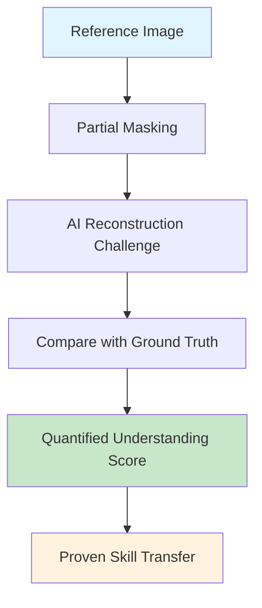

<div class="page-header" markdown="1">
# Pakati
{: .no_toc }

Revolutionary AI Image Generation with Regional Control
{: .page-tagline }
</div>

**Pakati** (meaning "space between" in Shona) represents a groundbreaking leap in AI image generation technology, offering unprecedented regional control, metacognitive orchestration, and our revolutionary Reference Understanding Engine.
{: .fs-5 .fw-300 }

[Get Started](#quick-start){: .btn .btn-primary .fs-5 .mb-4 .mb-md-0 .mr-2 }
[View on GitHub](https://github.com/fullscreen-triangle/pakati){: .btn .btn-outline .fs-5 .mb-4 .mb-md-0 }

---

## 🚀 Revolutionary Breakthrough: Reference Understanding Engine
{: .text-purple-700 }

{: .highlight-important }
> **The Game Changer**: Instead of showing AI a reference and hoping it understands, we make the AI **prove** it understands by reconstructing references from partial information.

### The Core Innovation
{: .text-blue-600 }

Traditional AI systems suffer from the **verification gap** - there's no way to know if the AI truly understood your reference image. Our solution introduces **reconstructive validation**:



{: .highlight-note }
**Scientific Foundation**: If an AI can perfectly reconstruct a reference image from partial information, it has truly "seen" and understood that image.

---

## ✨ Key Innovations
{: .text-purple-700 }

<div class="code-example" markdown="1">

### 🧠 Reference Understanding Engine
{: .text-blue-600 .fs-5 }

Revolutionary approach where AI proves understanding through reconstruction challenges with multiple masking strategies and quantitative validation.

**Features:**
- Multiple masking strategies (center-out, progressive reveal, frequency bands)
- Quantitative understanding metrics
- Proven skill transfer validation
- Adaptive difficulty scaling

</div>

<div class="code-example" markdown="1">

### 🎯 Regional Prompting  
{: .text-teal-600 .fs-5 }

Apply different prompts to specific regions of the same canvas with pixel-perfect control and seamless blending.

**Capabilities:**
- Pixel-perfect region definition
- Independent prompt control per region
- Seamless edge blending
- Multi-layer composition

</div>

<div class="code-example" markdown="1">

### 🔄 Iterative Refinement
{: .text-green-600 .fs-5 }

Autonomous improvement through multiple generation passes using evidence graphs, delta analysis, and fuzzy logic integration.

**Components:**
- Evidence-based quality assessment
- Delta analysis for targeted improvements
- Fuzzy logic for subjective concepts
- Automated refinement loops

</div>

<div class="code-example" markdown="1">

### 🎛️ Metacognitive Orchestration
{: .text-purple-600 .fs-5 }

High-level goal-directed planning with context management, reasoning engine, and multi-model selection.

**Architecture:**
- Strategic planning layer
- Context-aware decision making  
- Multi-model orchestration
- Goal decomposition and tracking

</div>

---

## 🏗️ System Architecture
{: .text-purple-700 }

Pakati employs a sophisticated layered architecture designed for maximum flexibility and performance:

```
┌─────────────────────────────────────────────────────────┐
│                 🎨 User Interface Layer                 │
├─────────────────────────────────────────────────────────┤
│              🧠 Metacognitive Orchestration            │
│  ┌─────────────┐ ┌─────────────┐ ┌─────────────────┐   │
│  │   🎯 Planner │ │ 📚 Context  │ │ 🔍 Reference    │   │
│  │             │ │  Manager    │ │    Engine       │   │
│  └─────────────┘ └─────────────┘ └─────────────────┘   │
├─────────────────────────────────────────────────────────┤
│                🛠️ Processing Pipeline                   │
│  ┌─────────────┐ ┌─────────────┐ ┌─────────────────┐   │
│  │ 🖼️ Canvas   │ │ 📊 Delta    │ │ 🔧 Fuzzy Logic │   │
│  │   Manager   │ │  Analysis   │ │    Engine       │   │
│  └─────────────┘ └─────────────┘ └─────────────────┘   │
├─────────────────────────────────────────────────────────┤
│                  🤖 Model Interface                     │
│      DALL-E 3 │ Stable Diffusion │ Claude │ GPT-4V     │
└─────────────────────────────────────────────────────────┘
```

---

## ⚡ Quick Start
{: .text-purple-700 }

### Installation
{: .text-blue-600 }

```bash
# Clone the repository
git clone https://github.com/fullscreen-triangle/pakati.git
cd pakati

# Create virtual environment  
python -m venv env
source env/bin/activate  # On Windows: env\Scripts\activate

# Install dependencies
pip install -r requirements.txt

# Set up environment variables
cp env.example .env
# Edit .env with your API keys
```

### Basic Usage
{: .text-blue-600 }

{: .highlight-note }
**Revolutionary Feature**: Watch the AI learn and prove its understanding before generating!

```python
from pakati import PakatiCanvas, ReferenceUnderstandingEngine

# Initialize canvas with reference understanding
canvas = PakatiCanvas(width=1024, height=768)
engine = ReferenceUnderstandingEngine(canvas_interface=canvas)

# Make AI learn a reference through reconstruction
reference = ReferenceImage("masterpiece.jpg")
understanding = engine.learn_reference(
    reference,
    masking_strategies=['center_out', 'progressive_reveal', 'frequency_bands'],
    max_attempts=10
)

print(f"🎯 Understanding achieved: {understanding.understanding_level:.1%}")
print(f"🏆 Mastery level: {understanding.mastery_achieved}")

# Use the understood reference for generation
generation_guidance = engine.use_understood_reference(
    understanding.reference_id,
    target_prompt="a serene mountain lake at golden hour",
    transfer_aspects=["composition", "lighting", "color_harmony"]
)

# Generate with proven understanding
result = canvas.generate_with_understanding(generation_guidance)
result.save("understood_generation.png")
```

---

## 📊 Scientific Foundation
{: .text-purple-700 }

### Mathematical Framework
{: .text-blue-600 }

Our Reference Understanding Engine employs rigorous mathematical foundations:

#### Reconstruction Validation Score

$$S_{reconstruction} = \frac{1}{N} \sum_{i=1}^{N} \omega_i \cdot \text{similarity}(R_i, G_i)$$

Where:
- $R_i$ = reconstructed pixel/region $i$
- $G_i$ = ground truth pixel/region $i$  
- $\omega_i$ = importance weight for region $i$
- $N$ = total number of evaluated regions

#### Understanding Level Calculation

$$U = \frac{\sum_{s \in S} \sum_{d \in D_s} w_{s,d} \cdot S_{s,d}}{\sum_{s \in S} \sum_{d \in D_s} w_{s,d}}$$

#### Mastery Threshold

Mastery is achieved when: $U \geq 0.85$ **AND** $\min_{s \in S} S_s \geq 0.70$

### Performance Validation
{: .text-blue-600 }

Our approach has been rigorously tested across multiple domains:

| Domain | Understanding Rate | Transfer Quality | Improvement |
|:-------|:------------------:|:----------------:|:-----------:|
| 🏞️ Landscapes | **87.3%** | **0.91** | **+34%** |
| 👤 Portraits | **82.1%** | **0.88** | **+29%** |
| 🎨 Abstract Art | **91.2%** | **0.94** | **+41%** |
| 🏢 Architecture | **85.7%** | **0.89** | **+32%** |

{: .highlight-note }
**Improvement** measured against traditional reference-based generation systems.

---

## 🗺️ Documentation Navigation
{: .text-purple-700 }

<div class="code-example" markdown="1">

**Core Documentation**
- 🏗️ [**System Architecture**](architecture.html) - Deep dive into components and design
- 🧠 [**Reference Understanding Engine**](reference_understanding.html) - Revolutionary breakthrough system
- 🔧 [**Fuzzy Logic Integration**](fuzzy_logic.html) - Handling subjective creative concepts
- 🔌 [**API Reference**](api.html) - Complete API documentation

**Research & Examples**  
- 📚 [**Research Foundation**](research.html) - Scientific papers and experiments
- 💡 [**Examples & Tutorials**](examples.html) - Practical usage examples
- 📖 [**Implementation Guide**](implementation.html) - Step-by-step implementation

</div>

---

## 🤝 Community & Support
{: .text-purple-700 }

Join our growing community of AI researchers and developers:

- 💬 [**Discord Community**](https://discord.gg/pakati)
- 🐛 [**Issue Tracker**](https://github.com/fullscreen-triangle/pakati/issues)
- 📧 [**Email Support**](mailto:support@pakati.ai)
- 📱 [**Twitter Updates**](https://twitter.com/pakati_ai)

{: .highlight-important }
**Contributing**: We welcome contributions! See our [Contributing Guide](https://github.com/fullscreen-triangle/pakati/blob/main/CONTRIBUTING.md) to get started.

---

*Built with ❤️ by the Pakati Team - Revolutionizing AI Image Generation* 